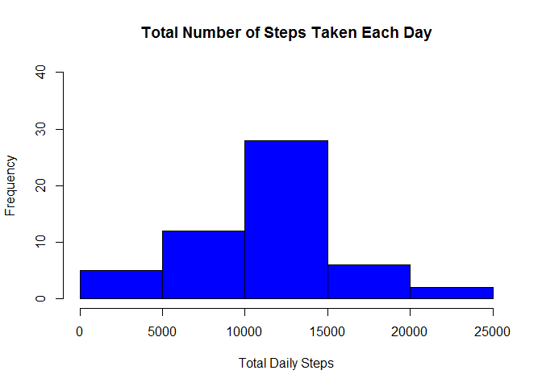
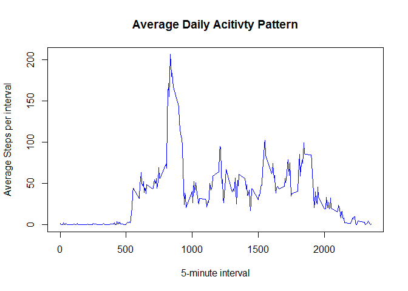
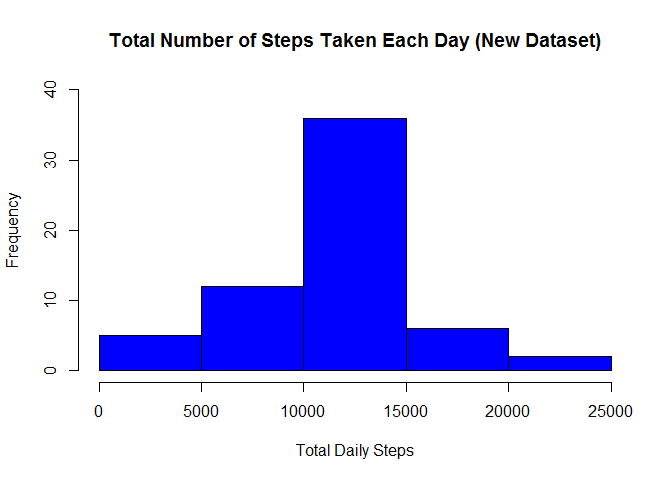
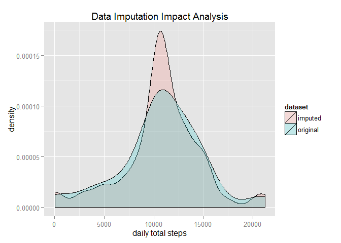
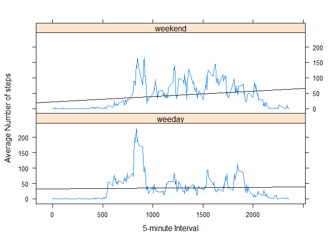

# Reproducible Research: Peer Assessment 1
Chao He  
17 October 2015  

## Loading and preprocessing the data
1. Load the data (i.e. read.csv())

```r
## assuming current working directory at 'RepData_PeerAssessment1'
## the forked and cloned project from gitHub
activity.data <- read.csv("activity/activity.csv")
```
2. Process/transform the data (if necessary) into a format suitable for your analysis

```r
library(dplyr)
```

```
## 
## Attaching package: 'dplyr'
## 
## The following objects are masked from 'package:stats':
## 
##     filter, lag
## 
## The following objects are masked from 'package:base':
## 
##     intersect, setdiff, setequal, union
```

```r
total.daily.steps <- 
        activity.data %>%
        filter(!is.na(steps)) %>%
        group_by(date) %>%
        summarize(totalSteps = sum(steps))
```
## What is mean total number of steps taken per day?
1. Make a histogram of the total number of steps taken each day

```r
hist(total.daily.steps$totalSteps, main="Total Number of Steps Taken Each Day", col = "blue",
     xlab = "Total Daily Steps", ylim = c(0, 40))
```

 

2. Calculate and report the <b>mean</b> and <b>median</b> total number of steps taken per day

### Mean

```r
mean(total.daily.steps$totalSteps)
```

```
## [1] 10766.19
```

### Median

```r
median(total.daily.steps$totalSteps)
```

```
## [1] 10765
```

## What is the average daily activity pattern?

```r
average.interval.steps <-
        activity.data %>%
        filter(!is.na(steps)) %>%
        group_by(interval) %>%
        summarize(averageSteps = mean(steps))
```

1. Make a time series plot (i.e. type = "l") of the 5-minute interval (x-axis) and the average number of steps taken, averaged across all days (y-axis)

```r
with(average.interval.steps, plot(interval, averageSteps, col = 'blue', type = "l", main = "Average Daily Acitivty Pattern", xlab = "5-minute interval", ylab = "Average Steps per interval"))
```

 

2. Which 5-minute interval, on average across all the days in the dataset, contains the maximum number of steps?

```r
max.interval.meanSteps <-
        average.interval.steps %>%
        filter(averageSteps == max(averageSteps))
```

### Max

```r
## 8:35am - 8:45am
max.interval.meanSteps
```

```
## Source: local data frame [1 x 2]
## 
##   interval averageSteps
## 1      835     206.1698
```

## Imputing missing values
1. Calculate and report the total number of missing values in the dataset (i.e. the total number of rows with NAs)

### Calculate value

```r
missing.value.count <- 
        activity.data %>%
        filter(is.na(steps)) %>%
        nrow
```

### Report value

```r
missing.value.count
```

```
## [1] 2304
```

2. Devise a strategy for filling in all of the missing values in the dataset. The strategy does not need to be sophisticated. For example, you could use the mean/median for that day, or the mean for that 5-minute interval, etc.

### Fill in all of the missing values with the mean of 5-minute interval

```r
activity.data.merged <- merge(activity.data, average.interval.steps, by='interval')
activity.data.merged$steps[is.na(activity.data.merged$steps)] <- activity.data.merged$averageSteps[is.na(activity.data.merged$steps)]
```
3. Create a new dataset that is equal to the original dataset but with the missing data filled in.

### Reshape the merged data based on original dataset

```r
activity.data.merged <-
        activity.data.merged %>%
        arrange(date, interval) %>%  ## sorting the data in the same way as original dataset
        select(steps, date, interval) ## removing additional column, reorder the rest columns in the same way as original dataset
```

4. Make a histogram of the total number of steps taken each day and Calculate and report the <b>mean</b> and <b>median</b> total number of steps taken per day. Do these value differ from the estimates from the first part of the assignment? What is the impact of imputing missing data on the estimates of the total daily number of steps?

### Make a histogram of the total number of steps taken each day

```r
total.daily.steps.merged <- 
        activity.data.merged %>%
        group_by(date) %>%
        summarize(totalSteps = sum(steps))

hist(total.daily.steps.merged$totalSteps, main="Total Number of Steps Taken Each Day (New Dataset)", col = "blue",
     xlab = "Total Daily Steps", ylim = c(0, 40))
```

 

### Calculate and report the <b>mean</b> and <b>median</b> total number of steps taken per day

#### Mean

```r
mean(total.daily.steps.merged$totalSteps)
```

```
## [1] 10766.19
```

#### Median

```r
median(total.daily.steps.merged$totalSteps)
```

```
## [1] 10766.19
```

### Do these value differ from the estimates from the first part of the assignment?

#### Combine original and new values together

```r
mean.value <- data.frame(origin = mean(total.daily.steps$totalSteps), new = mean(total.daily.steps.merged$totalSteps))
median.value <- data.frame(origin = median(total.daily.steps$totalSteps), new = median(total.daily.steps.merged$totalSteps))
```

#### Calculate and Display the difference of Mean Values

```r
mean.value <-
        mean.value %>%
        mutate(diff = new - origin)
row.names(mean.value) <- "Mean"
mean.value
```

```
##        origin      new diff
## Mean 10766.19 10766.19    0
```

#### Calculate and Display the difference of Median Values

```r
median.value <-
        median.value %>%
        mutate(diff = new - origin)
row.names(median.value) <- "Median"
median.value
```

```
##        origin      new     diff
## Median  10765 10766.19 1.188679
```

### What is the impact of imputing missing data on the estimates of the total daily number of steps?

#### Combine original dataset and imputed dataset

```r
total.daily.steps$dataset <- 'original'
total.daily.steps.merged$dataset <- 'imputed'
total.daily.steps.combined <- rbind(total.daily.steps, total.daily.steps.merged)
```

#### Plot and show the impact of imputing missing data

```r
library(ggplot2)
```

```
## Warning: package 'ggplot2' was built under R version 3.2.2
```

```r
ggplot(total.daily.steps.combined, aes(x = totalSteps, fill = dataset)) + geom_density(alpha = 0.2) + ggtitle("Data Imputation Impact Analysis") + xlab("daily total steps")
```

 

## Are there differences in activity patterns between weekdays and weekends?
1. Create a new factor variable in the dataset with two levels - "weekday" and "weekend" indicating whether a given date is a weekday or weekend day.

```r
activity.data.merged <-
        activity.data.merged %>%
        mutate(day = weekdays(as.Date(date))) %>%
        mutate(dayType = as.factor(ifelse(day == 'Sunday' | day == "Saturday", "weekend", "weekday")))
```

2. Make a panel plot containing a time series plot (i.e. type = "l") of the 5-minute interval (x-axis) and the average number of steps taken, averaged across all weekday days or weekend days (y-axis).

### Separate weekday data from weekend data

```r
weekday.steps <- activity.data.merged %>% filter(dayType == 'weekday')
weekend.steps <- activity.data.merged %>% filter(dayType == 'weekend')
```

### Summarize data in both groups

```r
## 
weekday.steps.average <-
        weekday.steps %>%
        filter(!is.na(steps)) %>%
        group_by(interval) %>%
        summarize(averageSteps = mean(steps)) %>%
        mutate(dayType = 'weeday')

weekend.steps.average <-
        weekend.steps %>%
        filter(!is.na(steps)) %>%
        group_by(interval) %>%
        summarize(averageSteps = mean(steps)) %>%
        mutate(dayType = 'weekend')
```

### Combine both datasets together

```r
week.steps.average <- 
        rbind(weekday.steps.average, weekend.steps.average) %>%
        mutate(dayType = as.factor(dayType))
```

### Plot data

```r
library(lattice)
```

```
## Warning: package 'lattice' was built under R version 3.2.2
```

```r
xyplot(averageSteps~interval | dayType, data = week.steps.average, 
       layout = c(1, 2),
       panel = function(x,y){
               panel.xyplot(x,y, type="l")
               panel.abline(lm(y~x))
       },
       xlab = "5-minute Interval",
       ylab = "Average Number of steps")
```

 
